  

  

  embedded systems &nbsp;·&nbsp; telemetry &nbsp;·&nbsp; fullstack &nbsp;·&nbsp; product

  

 

  

  

 

 

 

 

 

  
  
  
  
  
  

  

<h2 align="center">What I'm Building</h2>

[ SYSTEM ARCHITECTURE ] &nbsp;Baja SAE electronic platform — 4-node ECU network 
[ TELEMETRY ] &nbsp;ESP32 + CAN Bus real-time communication pipeline 
[ DATA ] &nbsp;RPM · Temperature · Speed · Fuel Level · GPS 
[ INTERFACE ] &nbsp;Live TFT dashboard for the pilot

 

<h2 align="center">Current Focus</h2>

[ EMBEDDED ] &nbsp;Software architecture & real-time systems 
[ ALGORITHMS ] &nbsp;Data structures in Rust — trees, graphs, spatial search 
[ COMMUNICATION ] &nbsp;CAN Bus · Bluetooth 
[ PRODUCT ] &nbsp;Backlog, requirements & user stories — building what matters

  

  
  

  

 

  

 

  <picture>
    <source media="(prefers-color-scheme: dark)" srcset="https://raw.githubusercontent.com/HeitorM50/HeitorM50/output/github-contribution-grid-snake-dark.svg">
    <source media="(prefers-color-scheme: light)" srcset="https://raw.githubusercontent.com/HeitorM50/HeitorM50/output/github-contribution-grid-snake.svg">
    
  </picture>

  

  

